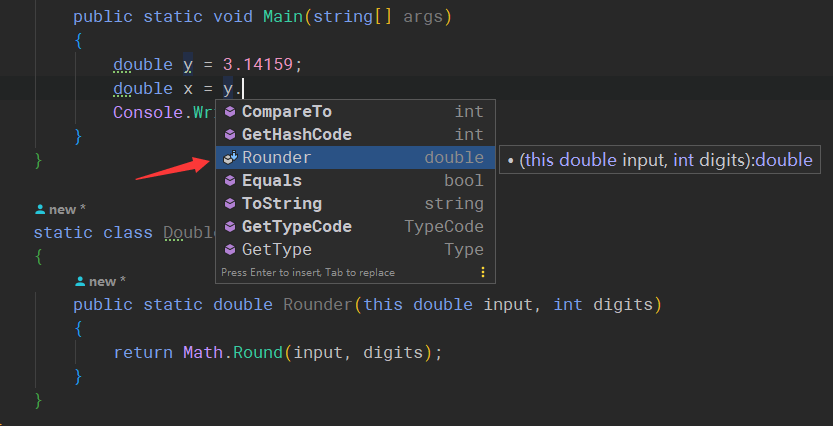

# Csharp 课程笔记
    课程视频源自B站 av1422127 ，每一节课的笔记都以二级标题展示，
    每一节课的多个小节通过三级标题分开，小节之后的练习题（如果有），
    练习题通过四级标题分开
### 骚东西

```c#
// 在C#中如果实例化对象后需要立马给对象内的属性附初始值，可以通过一下骚操作
public class Student
{  
    public string Name { get; set; }
}

class Main{
    void main(){
        Student stu = new Student() {Name = "Tim"}; // 给对象中的属性赋初值
        // 如果没有构造器需要传入参数的话， 甚至可以省略 () 
        new Student{Name = "Tim"} === new Student() {Name = "Tim"}
    }
}
```


### 字段

> 表示与类型或对象关联的变量  （字段命名使用名词）

- 静态字段（类被调用的时候初始化）与类相关联的成为静态字段，直接通过类名调用
- 实例字段（类被创建的时候）与对象相关联的成为实例字段，必须在实例化之后才可以使用

```c#
    public class FiledDemo
    {
        public void demoMethod()
        {
            List<Student> stuList = new List<Student>();
            for (int i = 0; i < 100; i++)
            {
                Student stu = new Student();
                stu.age = 24; // 实例字段在实例化之后才可以赋值
                stu.score = 90;
                stuList.Add(stu);
            }

            int totalAge = 0;
            int totalScore = 0;
            foreach (var stu in stuList)
            {
                totalScore += stu.score;
                totalAge += stu.age;
            }

            Student.AverageAge = totalAge / Student.Amount; 
            // 注意到静态字段没有实例化直接调用
            Student.AverageScore = totalScore / Student.Amount; 
            // 并且静态字段实例后没有办法直接赋值
            Console.WriteLine(stuList);
            Student.ReportAmount();
            Student.ReportAverageAge();
            Student.ReportAverageScore();
            
            // 静态只读字段
            Console.WriteLine("R:{0}",Brush.DefaultColor.Red);
            Console.WriteLine("G:{0}",Brush.DefaultColor.Green);
            Console.WriteLine("B:{0}",Brush.DefaultColor.Blue);
        }
    }

    public class Student
    {
        // 实例字段
        public int age;

        public int score;

        // 只读实例字段
        public readonly int ID;

        // 静态字段
        public static int AverageAge;
        public static int AverageScore;
        public static int Amount = 0;
        
        public Student()  // 构造器
        {
            Student.Amount++;  // 100
        }
        static Student()  // 静态构造器仅被调用一次，而不管该对象被实例化多少次
        {
            Student.Amount++;  // =1
        }

        public static void ReportAmount()
        {
            Console.WriteLine(Student.Amount);
        }

        public static void ReportAverageScore()
        {
            Console.WriteLine(Student.AverageScore);
        }

        public static void ReportAverageAge()
        {
            Console.WriteLine(Student.AverageAge);
        }
    }

    struct Color
    {
        public int Red;
        public int Green;
        public int Blue;
    }

    class Brush
    {
        public static readonly Color DefaultColor = new Color() {Red = 0, Green = 0, Blue = 0};
    }
```


### 属性

> 访问对象或类的特征（状态）的成员，是字段的自然扩展，对外暴露数据，对内保护字段

完整属性带有的getter/setter其实是 get() / set() 方法进化而来的语法糖，通过反编译就可以找到，只不过在语法层面封装后方便代码的整洁。

```C#
public class P17
{
    public void demoMethod()
    {
        try
        {
            Student student = new Student();
            student.Age = 12;
            Console.WriteLine(student.canWork);
            // student.Score = 99;  // 没有setter就会报错，此时Score成为只读属性
            // student.Gender = 20;  // setter 是私有方法，只能在类内部使用
        }
        catch (Exception e)
        {
            Console.WriteLine(e.Message);
        }
    }
}


class Student
{
    // public int Age;  // 这个字段怎么不被外界污染呢
    private int age;

    public int Age
    {
        get => age;
        set
        {
            if (value > 0 && value < 120)
            {
                this.age = value; // value 称为上下文关键字
            }
            else
            {
                throw new Exception("age is invalid");
            }
        }
    }

    private int amount;

    public int Amount
    {
        get => amount;
        set
        {
            if (value >= 0)
            {
                this.amount = value;
            }
            else
            {
                throw new Exception("amount is invalid");
            }
        }
    }

    // 简写属性
    public int Score { get; }
    public string Gender { private set; get; }

    public bool canWork
    {
        // 属性的值通过 getter 动态计算
        get
        {
            if (this.age >= 18)
            {
                return true;
            }
            else

            {
                return false;
            }
        }
    }
}
```


### 索引器

```c#
public class P17
{
    public void demoMethod()
    {
        Student student = new Student();
        student["Math"] = 20;
        var mathScore = student["Math"];
        Console.WriteLine(mathScore);
    }
}


class Student
{
    private Dictionary<string, int> scoreDict = new Dictionary<string, int>();

    public int? this[string subject] // 可空的整形
    {
        get
        {
            /* return the specified index here */
            if (this.scoreDict.ContainsKey(subject))
            {
                return this.scoreDict[subject];
            }
            else
            {
                return null;
            }
        }
        set
        {
            if (!value.HasValue)
            {
                throw new Exception("subject is null");
            }

            if (this.scoreDict.ContainsKey(subject))
            {
                this.scoreDict[subject] = value.Value; // nullable int 通过 .Value 赋值
            }
            else
            {
                this.scoreDict.Add(subject, value.Value);
            }
        }
    }
}
```


### 常量

> 编译时直接计算的值，隶属于类型而不是对象， **没有实例常量**这么一说

- 执行效率高，编译时直接将引用位置替换为写死的值
- 与只读属性有一定的相似度

“只读”有以下几种应用场景：

1. 常量 提高运行效率
2. 只读字段 防止对象的值被修改
3. 只读属性 对外暴露不允许修改的数据
4. 静态只读字段 （类/自定义结构体）

其中最后一条，由于常量 `const` 只允许使用基本数据类型，当数据变得复杂的时候，常量就不接受这种定义方式， 但是我又想让这种复杂参数只读，这种情况下就需要借助**静态只读字段**

```C#
const PI = 3.14;
```

*实例常量这一角色可以通过只读实例字段来表示*  当然了归根到底还是字段，会参与运算，不如常量来得直接。


### 对象参数

```c#
public static void Main(string[] args)
{
    Student stu1 = new Student() {Name = "tom"};
    SomeMeth(stu1);
    Console.WriteLine("Hash={0}, Name={1}", stu1.GetHashCode(), stu1.Name);
    Console.WriteLine("=========");
    UpdateObj(stu1);
    
}

static void UpdateObj(Student stu)
{
    // 这里将传入的对象没有实例化，而是直接修改对象的参数
    stu.Name = "Inna"; // 称为副作用，尽量别用
    Console.WriteLine("Hash={0}, Name={1}", stu.GetHashCode(), stu.Name);
}

static void SomeMeth(Student stu)
{
    // 传值参数是对象，但是copy了一个副本，没有改变原来的对象
    stu = new Student() {Name = "tim"};
    Console.WriteLine("Hash={0}, Name={1}", stu.GetHashCode(), stu.Name);
}
```


### 引用参数

通过 ref 关键子去引用原本调用的参数，方法体内部对这个参数的修改不会创建副本，而是直接在这个变量上改变。

##### 引用基本参数

```c#
public static void Main(string[] args)
{
    int y = 10;
    SideEff(ref y);
    Console.WriteLine(y);  // 被引用的 y 由原本的 10->20
}
static void SideEff(ref int x)
{
    x += 10;
}
```

##### 引用对象

```c#
// 非引用情况下
public static void Main(string[] args)
{
    Student outter = new Student(){Name = "Tom"};
    Console.WriteLine("Hash={0}, Name={1}", outter.GetHashCode(), outter.Name);
    
    Console.WriteLine("------------");

    SideEffObj( outter);  // 调用静态方法的时候没有任何改变 所以输出的是 tim 
    Console.WriteLine("Hash={0}, Name={1}", outter.GetHashCode(), outter.Name);
}
static void SideEffObj( Student student)
{
    student = new Student() {Name = "tim"};
    Console.WriteLine("Hash={0}, Name={1}", student.GetHashCode(), student.Name);
}
// Hash=46104728, Name=Tom
// -----------------------
// Hash=12289376, Name=tim
// Hash=46104728, Name=Tom
```

```c#
// 引用的情况下 ref 关键字引用对象
public static void Main(string[] args)
{
    Student outter = new Student() {Name = "Tom"};
    Console.WriteLine("Hash={0}, Name={1}", outter.GetHashCode(), outter.Name);
    // 上面直接修改对象属性
    Console.WriteLine("------------");
	// 下面引用对象，将新实例传入，这个新的实例被 new 替换为 tim
    // 被替换的 tim 将本方法中的 outter 也一并替换了（引用的副作用）
    SideEffObj(ref outter);
    Console.WriteLine("Hash={0}, Name={1}", outter.GetHashCode(), outter.Name);
}
static void SideEffObj(ref Student student)
{
    // 引用对象
    student = new Student() {Name = "tim"};
    Console.WriteLine("Hash={0}, Name={1}", student.GetHashCode(), student.Name);
}
// Hash=46104728, Name=Tom
// ------------
// Hash=12289376, Name=tim
// Hash=12289376, Name=tim
```

```c#
// 直接修改对象属性
public static void Main(string[] args)
{
    Student outter = new Student() {Name = "Tom"};  // 实例化一次
    Console.WriteLine("Hash={0}, Name={1}", outter.GetHashCode(), outter.Name);  // Tom
    // 上面对象在实例化的时候通过新的赋值改变了原有属性
    Console.WriteLine("------------");
    SideEffObj(outter);  // 调用一次 修改Tom->Tim  cw -> Tim
    // 再次调用的时候，原本对象的属性已经被修改 -> Tim
    Console.WriteLine("Hash={0}, Name={1}", outter.GetHashCode(), outter.Name); 
}
static void SideEffObj(Student student)
{
    student.Name = "Tim";
    Console.WriteLine("Hash={0}, Name={1}", student.GetHashCode(), student.Name);
}
// Hash=46104728, Name=Tom
// ------------
// Hash=46104728, Name=Tim
// Hash=46104728, Name=Tim 
```

上面的情况中，outter 与 `SideEffObj` 中的 student 参数在内存中不是同一个地址，*因为在非引用情况下传入的参数会被创建一个副本* ， 但是如果将传递参数改为 `ref` 引用的话，那么 outter 与 `SideEffObj` 中的 student 所指向的就是同一个地址，拿基本类型来举个例子就容易理解了

```c#
public static void Main(string[] args) {
    int y = 100;
    Console.WriteLine("Hash={0}, Name={1}", y.GetHashCode(), y);
    noneEff(y);
    Console.WriteLine("Hash={0}, Name={1}", y.GetHashCode(), y);
}
// 非引用情况下 对传入的参数都会进性 copy 
static void noneEff(int x) {
    x += 10;
    Console.WriteLine("Hash={0}, Name={1}", x.GetHashCode(), x);
}
// Hash=100, Name=100
// Hash=110, Name=110
// Hash=100, Name=100

// 引用类型修改了 main 中的 y 
static void SideEff(ref int x) {
    x += 10;
    Console.WriteLine("Hash={0}, Name={1}", x.GetHashCode(), x);
}
// Hash=100, Name=100
// Hash=110, Name=110
// Hash=110, Name=110
```

### 输出参数

#### 输出基本类型参数

```c#
Console.WriteLine("输入一个数");
double x = 0;
string arg = Console.ReadLine();
if (double.TryParse(arg, out x))
{
    Console.WriteLine("string parse to double{0}",x);
}
else
{
    return;
}
```


#### 输出引用类型参数

```c#
internal class Program
{
    // 主程序
    public static void Main(string[] args)
    {
        Student stu = null;
        // 将创建成功的对象赋值给 stu
        bool b = StudentFactory.Create("Tim", 30, out stu); 
        if (b)
        {
            Console.WriteLine("name={0} age={1}", stu.Name, stu.Age);
        }
        else
        {
            Console.WriteLine("fail");
        }
    }
}

class Student
{
    public int Age { set; get; }
    public string Name { set; get; }
}

class StudentFactory
{
    public static bool Create(string name, int age, out Student result)
    {
        result = null;
        if (string.IsNullOrEmpty(name))
        {
            return false;
        }
        else if (age < 20 || age > 80)
        {
            return false;
        }

        // out 结果需要赋值
        result = new Student() {Name = name, Age = age};
        return true;
    }
}
```

### 数组参数

```c#
public static void Main(string[] args)
{
    int[] arr = new int[]{1,2,32,45,6};
    Console.WriteLine(reducer(arr));
}

static int reducer(int[] intArry)
{
    int sum = 0;
    foreach (var i in intArry)
    {
        sum += i;
    }

    return sum;
}
```

但是如此生命数组很麻烦， 需要使用 `new Int[]{}` 对象，实际上，如果函数添加 `params` 就可以简化这一操作

```c#
reducer(1,2,32,45,6)  // 这样调用
static int reducer(params int[] intArry) // 添加params
```

注意：==为了将数组参数与其他参数区分出来， 数组参数最好放在最后一位==

### 具名参数

> 1. 提高代码可读性
> 2. 参数的位置不受参数所在顺序约束

```c#
Println(age:20,name:"王花花");
static void Println(string name, int age)
{
    Console.WriteLine("{0} is {1} years old", name, age);
}
```

### 可选参数

可选参数直接在声明的时候赋值，类似 `JS` 中的做法

```c#
static void Println(string name="whh", int age="10")
```

### 扩展方法

如何自己为 `double` 类型扩展方法呢？ 在JS中我们有 prototype 通过这个我们可以将自己写的方法扩展到原有类型里。但是在 c# 中没有 prototype , 找到 double 源码硬核扩展吗？ 相比这是不现实的，在 c# 中存在一个方法 `this` 就有一种神奇的功能

```c#
public static void Main(string[] args)
{
    double y = 3.14159;
     // 本如果想把 五位数转为六位数就需要 Math.Round
    double x = Math.Round(y, 4); 
    Console.WriteLine(x);
}
// 可不可以给 double 类型扩展一个方法
// 扩展方法需要静态类
internal class Program
{
    // 主程序
    public static void Main(string[] args)
    {
        double y = 3.14159;
        double x = y.Round(4);
        Console.WriteLine(x);
    }
}

static class Double
{
    // 通过 this 扩展了 y 这一 double 类型的方法
    public static double Round(this double input, int digits)
    {
        return Math.Round(input, digits);
    }
}
```



注意到此时方法的图标也会发生改变